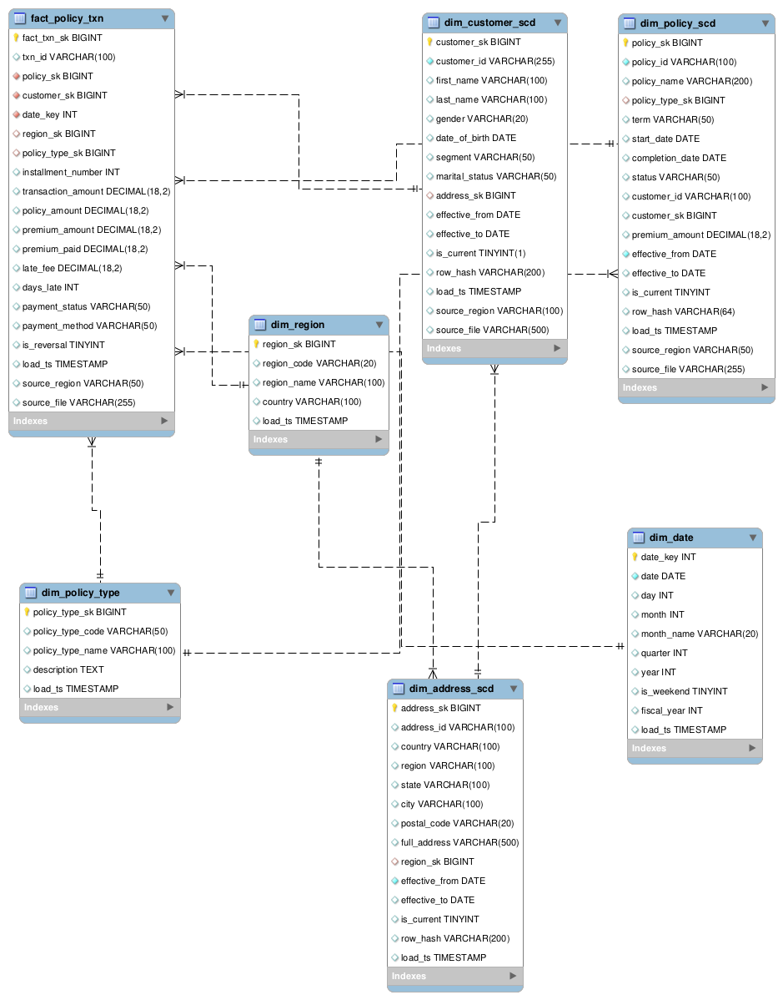
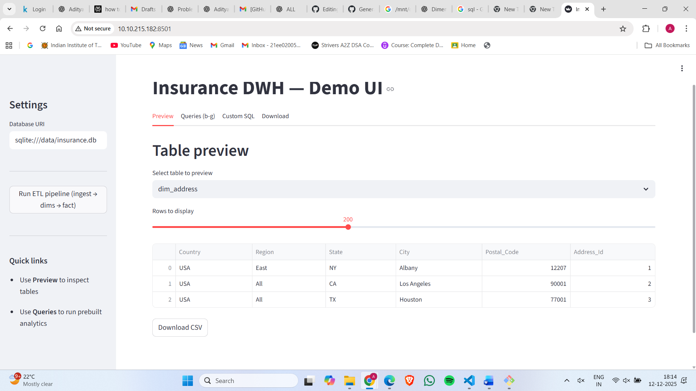

d_# HCL_Hackathon
# Team DDEE-BOYZ
Collaborators are 
@mygit021 - Harsh Raj - 21EE02004
@adityankr911 - Aditya Roy - 21EE02005
@ramateja1234 - Bollepalli RamaTeja - 21EE02008

# Data Warehouse Schema Documentation

This document describes the dimensional model used in the insurance analytics data warehouse.  
The warehouse follows a classic **star schema** with multiple dimension tables,  
**three Slowly Changing Dimensions (SCD Type 2)**—customer, policy, and address—and a central fact table for policy transactions.

The design supports:

- Historical tracking of customer attributes  
- Historical tracking of policy details  
- Historical tracking of address changes  
- Region-based reporting  
- Date-based analytics  
- Detailed premium and transaction metrics  

---

# Dimension Tables

---

## 1. dim_date (Conformed Date Dimension)

**Grain:** One row per calendar date.

This table provides standardized date attributes used across the entire warehouse for time-based reporting.

**Key Attributes:**
- `date_key` (YYYYMMDD, PK)
- `date`
- `day`, `month`, `month_name`, `quarter`, `year`
- `is_weekend`
- `fiscal_year`
- `load_ts`

**Purpose:** Enables consistent filtering and aggregation by all date-related properties such as month, quarter, and fiscal year.

---

## 2. dim_region

**Grain:** Region.

Contains business regions such as EAST, WEST, NORTH, and SOUTH.  
Referenced by the address dimension and the fact table.

**Key Attributes:**
- `region_sk` (PK)
- `region_code`
- `region_name`
- `country` (default: United States)
- `load_ts`

**Purpose:** Provides a standard reference for region-based reporting.

---

## 3. dim_address_scd (SCD Type 2)

**Grain:** Address record at a specific point in time.

This dimension maintains **historical versions** of customer addresses.  
Whenever a customer's address changes, a new row is created.

**Key Attributes:**
- `address_sk` (PK surrogate)
- `address_id` (natural key from source)
- `country`, `region`, `state`, `city`, `postal_code`
- `full_address`
- `region_sk` (FK → dim_region)
- `effective_from` (start of this version)
- `effective_to` (end of this version; NULL if current)
- `is_current` (TRUE for active address)
- `row_hash` (used for change detection)
- `load_ts`

**Purpose:** Supports accurate historical address tracking and point-in-time reporting for customer attributes and transactions.

---

## 4. dim_policy_type

**Grain:** Policy type (e.g., Auto, Home, Life, Health).

A static lookup dimension containing the list of valid policy categories.

**Key Attributes:**
- `policy_type_sk` (PK)
- `policy_type_code`
- `policy_type_name`
- `description`
- `load_ts`

**Purpose:** Standard classification of policies used for reporting and segmentation.

---

## 5. dim_customer_scd (SCD Type 2)

**Grain:** Customer at a specific point in time.

Tracks historical changes in customer attributes such as segment, marital status, and **address**.  
When any tracked attribute changes, a new record is inserted and older records are marked inactive.

**Key Attributes:**
- `customer_sk` (PK surrogate)
- `customer_id` (business key)
- `first_name`, `last_name`, `gender`, `date_of_birth`
- `segment`
- `marital_status`
- `address_sk` (FK → dim_address_scd)
- `effective_from`, `effective_to`, `is_current`
- `row_hash`
- `load_ts`, `source_region`, `source_file`

**Purpose:** Preserves full customer history for accurate point-in-time reporting and analytics.

---

## 6. dim_policy_scd (SCD Type 2)

**Grain:** Policy at a specific point in time.

Tracks historical changes in policy details such as policy type, term, status, and premium amount.  
A new row is added when tracked attributes change.

**Key Attributes:**
- `policy_sk` (PK)
- `policy_id`
- `policy_name`
- `policy_type_sk` (FK → dim_policy_type)
- `term`
- `start_date`, `completion_date`
- `status`
- `customer_sk` (FK → dim_customer_scd)
- `premium_amount`
- `effective_from`, `effective_to`, `is_current`
- `row_hash`
- `load_ts`, `source_region`, `source_file`

**Purpose:** Supports historical reconstruction of policy states and accurate reporting at any point in the policy lifecycle.

---

# Fact Table

---

## fact_policy_txn

**Grain:** One row per payment or financial transaction (e.g., premium installment).

This table captures all monetary activities associated with policies, including premiums, late fees, and payment status.

**Key Relationships:**
- `policy_sk` → dim_policy_scd (policy version valid at transaction date)
- `customer_sk` → dim_customer_scd (customer version valid at transaction date)
- `date_key` → dim_date
- `region_sk` → dim_region
- `policy_type_sk` → dim_policy_type

**Key Measures & Attributes:**
- `transaction_amount`
- `premium_amount`
- `premium_paid`
- `late_fee`
- `days_late`
- `payment_status`
- `payment_method`
- `installment_number`
- `is_reversal`
- `load_ts`, `source_region`, `source_file`

# Insurance Data Preprocessing Pipeline (Brief Documentation)

This preprocessing workflow prepares raw insurance datasets for ingestion into the data warehouse.  
It performs data cleaning, customer name standardization, date normalization, schema enforcement, and missing value handling.

---

## 1. Loading Raw Data
Three input files are loaded:

- `Insurance_details_US_Central_day0.csv`
- `Insurance_details_US_Central_day1.csv`
- `Insurance_details_US_Central_day2.csv`

Each file includes customer details, policy information, geographic attributes, and premium-related fields.

---

## 2. Merging Customer Name Components
The raw dataset stores name components separately:

- Customer Title  
- Customer First Name  
- Customer Middle Name  
- Customer Last Name  

These are merged into a unified field:
Customer Name = "<Title> <First> <Middle> <Last>"

The original name columns are then removed.

**Purpose:** Creates a consistent, clean identifier for customers.

---

## 3. Standardizing Date Columns
All date-related columns are converted into valid datetime objects using a custom function.  
Converted fields include:

- DOB  
- Effective_Start_Dt  
- Effective_End_Dt  
- Policy_Start_Dt  
- Policy_End_Dt  
- Next_Premium_Dt  
- Actual_Premium_Paid_Dt  

Invalid or inconsistent formats are automatically converted to `NaT`.

**Purpose:** Ensures clean, SQL-compatible date values.

---

## 4. Enforcing a Strict Schema
A predefined list of column names is applied to guarantee uniform structure across all daily data files.  
The function:

- Validates column count  
- Applies positional renaming  
- Ensures all datasets follow an identical schema  

**Purpose:** Enables reliable downstream loading into data warehouse tables.

---

## 5. Handling Missing Values
The function `fill_missing_by_type()` fills missing values based on data type:

- Date fields → `1900-01-01`
- Numeric fields → `0`
- Text fields → `"N/A"`

Numeric values are converted to integers where applicable.

**Purpose:** Eliminates NULL-related problems during SQL ingestion and analytics.

---

## 6. Exporting Cleaned Files
Cleaned insurance datasets are exported as:

- `Central_day0.csv`
- `Central_day1.csv`
- `Central_day2.csv`

These files now contain:

- Standardized customer names  
- Clean date formats  
- Strict and consistent schema  
- No missing values  
- DW-ready structure  

---

## Summary of the Processing Pipeline

| Step | Description |
|------|-------------|
| Load raw CSV files | Initialize input data |
| Merge customer name | Combine title, first, middle, last names |
| Standardize date formats | Normalize all date columns |
| Enforce strict schema | Apply consistent column naming |
| Handle missing values | Fill NULLs by type |
| Export final CSVs | Output cleaned DW-ready datasets |

---

This pipeline ensures consistent, high-quality data for loading into the insurance data warehouse.

# SQL Query Documentation
Milestone.sql file contains the test queries to extract the desired output.
This section summarizes the purpose of each analytical query used in the insurance data warehouse.  
Only the intent and functionality of each query are described below.

---

## 1. Detect Customers Who Changed Their Policy Type
Identifies customers whose **current policy type differs from their previous one** by comparing policy records ordered by policy start date.  
Useful for analyzing customer behavior, product transitions, and cross-selling opportunities.

---

## 2. Calculate Total Policy Amount per Customer
Aggregates and returns the **total insured amount for each customer** across all their policies.  
Supports customer-level financial analysis and portfolio valuation.

---

## 3. Compute Total Policy Amount for Auto Policies
Calculates the **total insurance amount for all Auto-type policies**.  
Helps evaluate product-line performance and Auto business exposure.

---

## 4. Sum Policy Amounts for East/West Regions (Quarterly, Year 2012)
Filters transactions by:
- Region (East/West),
- Policy term (Quarterly),
- Policy start year (2012),

and computes their combined policy value.  
Useful for assessing regional performance for specific products in a given year.

---

## 5. Identify Customers With Marital Status Changes
Finds customers who have **more than one marital status recorded** in the customer dimension.  
Indicates changes captured through SCD Type 2 or multiple lifecycle events.

---

## 6. Produce Enriched Transaction-Level Output
Creates a unified view by joining fact records with customer and policy dimensions.  
Adds customer details (name, location) and policy attributes (type, name) to the fact table for reporting and BI dashboards.

---

This documentation provides a high-level understanding of each analytical component without exposing SQL code details.

